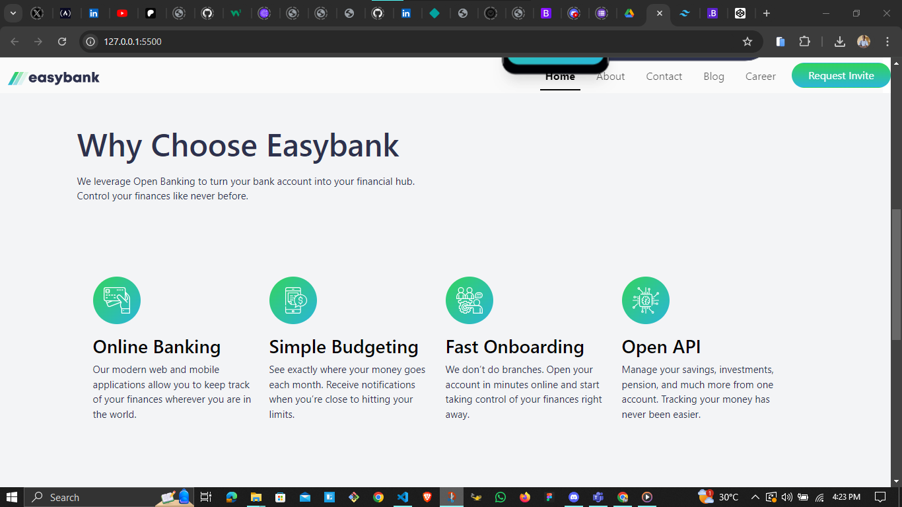

# Web3Bridge-Frontend Mentor - Easybank landing page solution

This is a solution to the [Easybank landing page challenge on Frontend Mentor](https://www.frontendmentor.io/challenges/easybank-landing-page-WaUhkoDN). Frontend Mentor challenges help you improve your coding skills by building realistic projects.

## Table of contents

- [The challenge](#the-challenge)
- [Screenshot](#screenshot)
- [Links](#links)
- [Built with](#built-with)

### The challenge

Users should be able to:

- View the optimal layout for the site depending on their device's screen size
- See hover states for all interactive elements on the page

### Screenshot

### Links

- Github Repo [https://github.com/OlaiwonAbdullahi/Web3Bridge-Easy-Banking/](https://github.com/OlaiwonAbdullahi/Web3Bridge-Easy-Banking/)
- Live Site URL: [https://web3bridge-easy-banking.netlify.app/](https://web3bridge-easy-banking.netlify.app/)

### Built with

- Semantic HTML5 markup
- CSS custom properties
- Flexbox
- CSS Grid
- Mobile-first workflow
- [Bootsrap](https://getbootstrap.com/)
